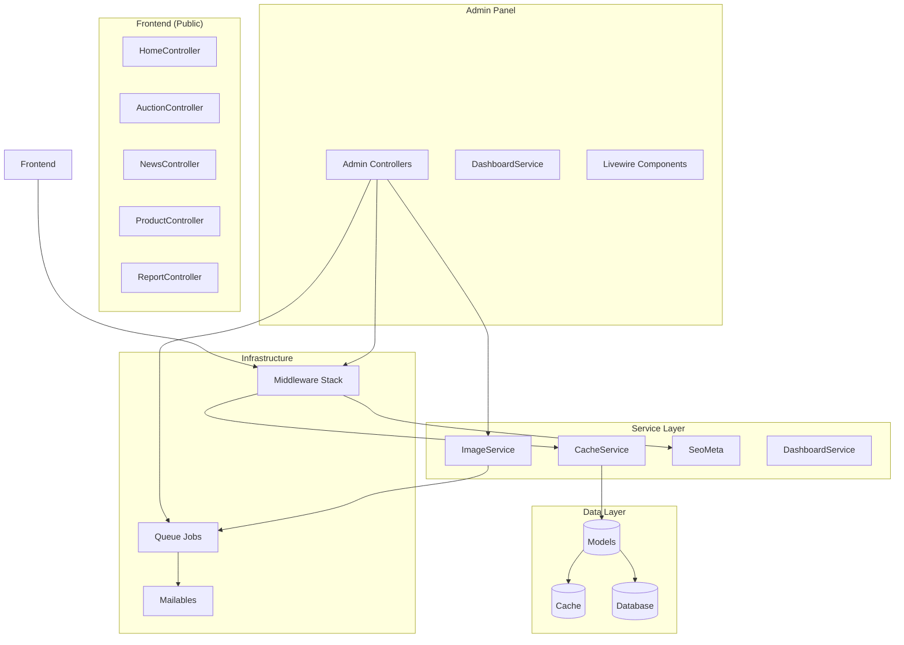
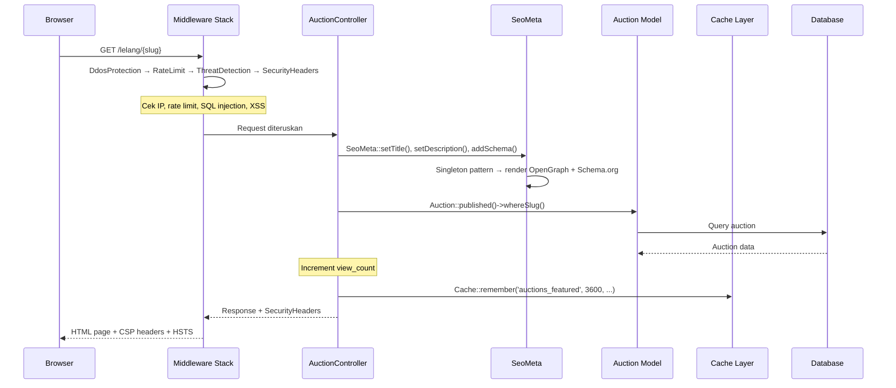
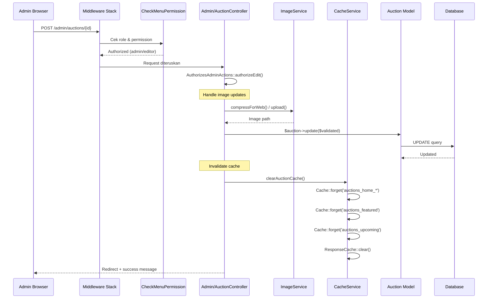
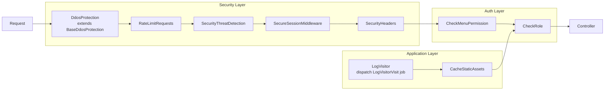
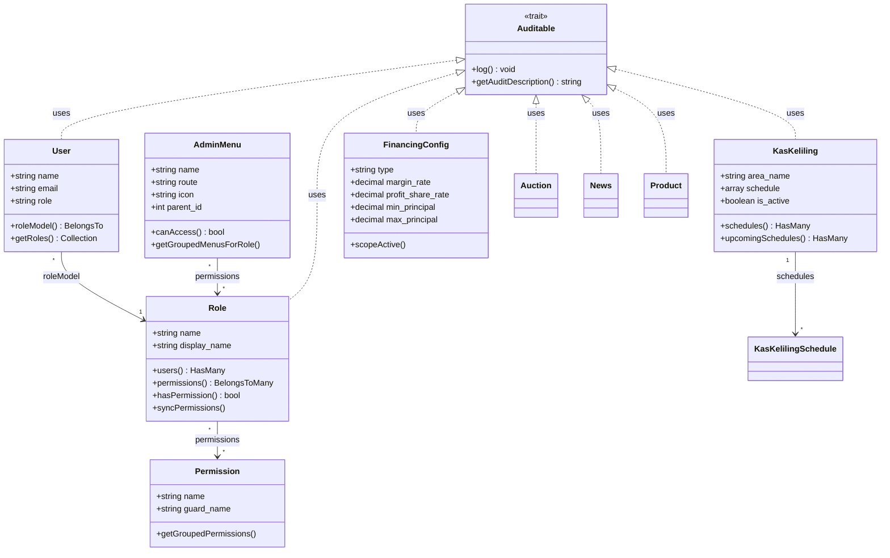
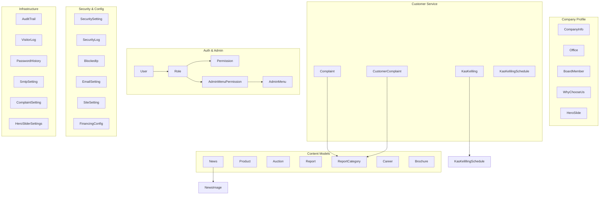
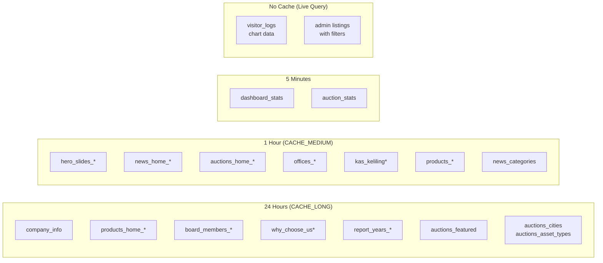
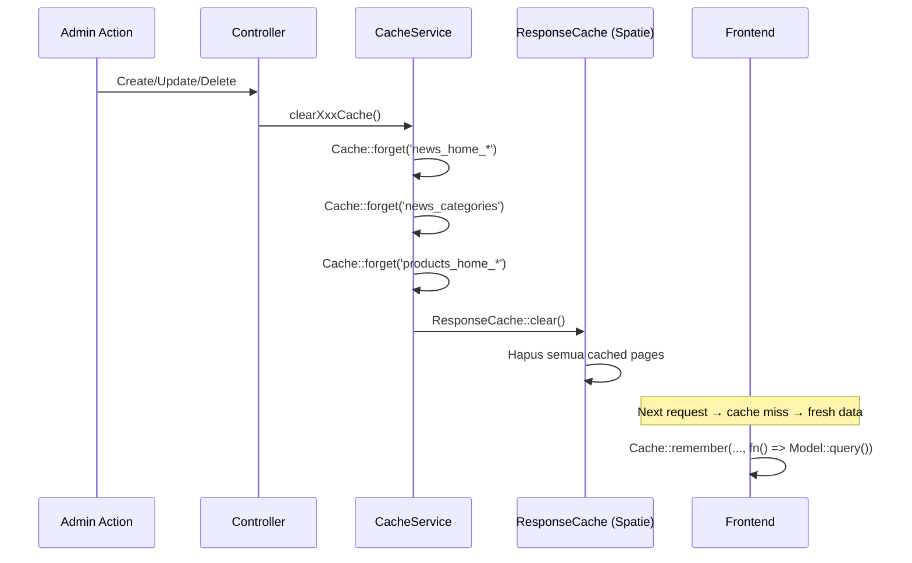
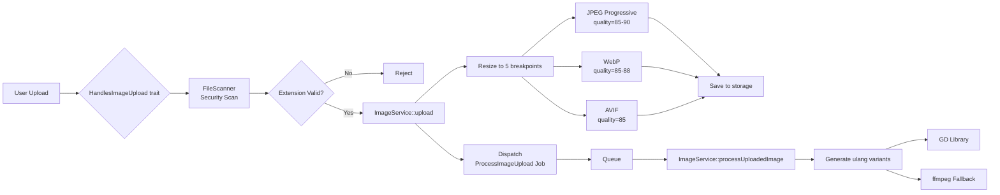

# Architecture Documentation — BPRS Bangka Belitung CMS

> Generated from graphify codebase analysis

---

## Table of Contents
1. [System Overview](#1-system-overview)
2. [Request Flow](#2-request-flow)
3. [Middleware Stack](#3-middleware-stack)
4. [Model Layer (Community 24 Hub)](#4-model-layer)
5. [Caching Architecture](#5-caching-architecture)
6. [Image Processing Pipeline](#6-image-processing-pipeline)
7. [Email & Queue System](#7-email--queue-system)
8. [Performance Analysis](#8-performance-analysis)

---

## 1. System Overview



---

## 2. Request Flow

### Public Page Request (e.g. Auction Detail)



### Admin CRUD Request (e.g. Update Auction)



---

## 3. Middleware Stack



### Layer Details

| # | Middleware | Class | Thresholds | Response on Block |
|---|---|---|---|---|
| 1 | **DdosProtection** | `app/Http/Middleware/DdosProtection.php` | 10 req/s, 120/min, 3000/h | 429 + progressive block (5min→24h) |
| 2 | **RateLimitRequests** | `app/Http/Middleware/RateLimitRequests.php` | Configurable per route | 429 Too Many Requests |
| 3 | **SecurityThreatDetection** | `app/Http/Middleware/SecurityThreatDetection.php` | 79 regex patterns (SQLi, XSS, etc) | 403 + auto-block IP at 5 violations |
| 4 | **SecureSessionMiddleware** | `app/Http/Middleware/SecureSessionMiddleware.php` | Device fingerprint mismatch → hijack | 302 redirect to login + session invalidate |
| 5 | **SecurityHeaders** | `app/Http/Middleware/SecurityHeaders.php` | CSP, HSTS, X-Frame-Options | N/A (response header) |
| 6 | **CheckMenuPermission** | `app/Http/Middleware/CheckMenuPermission.php` | Role-based menu access | 403 if no permission |
| 7 | **CheckRole** | `app/Http/Middleware/CheckRole.php` | Role-based route access | 403 if wrong role |
| 8 | **LogVisitor** | `app/Http/Middleware/LogVisitor.php` | N/A | Dispatches `LogVisitorVisit` job |

---

## 4. Model Layer

### Community 24 — Central Model Hub



### Full Model Map



---

## 5. Caching Architecture

### Cache Keys & Durations



### Invalidation Flow



### Cache Invalidation Mapping

| Admin Action | Cache Cleared | Method |
|---|---|---|
| News CRUD | `news_home_*`, `news_categories` + ResponseCache | `clearNewsCache()` |
| Product CRUD | `products_home_*`, `products_*` + ResponseCache | `clearAll()` |
| Auction CRUD | `auctions_home_*`, `auctions_featured`, `auctions_upcoming`, `auctions_asset_types`, `auctions_cities` + ResponseCache | `clearAuctionCache()` |
| Site Settings | `site_settings` + Cache flush | `clearCache()` (model) |
| Company Info | `company_info` + ResponseCache | `clearCache()` (model) |
| Office CRUD | `offices_all`, `offices_*` + ResponseCache | booted() callback |
| Member CRUD | `board_members_*` | booted() callback |
| Kas Keliling | `kas_keliling`, `kas_keliling_schedules` + ResponseCache | `clearKasKelilingCache()` |
| Report CRUD | `report_years_*` + Cache flush + ResponseCache | `clearReportCache()` |
| Why Choose Us | `why_choose_us*` | `clearAll()` |
| **Bulk Clear** | ALL cache keys (18+ types) | `clearAll()` |

---

## 6. Image Processing Pipeline



### Breakpoint Output per Upload

| Format | Mobile | Small | Medium | Large | Original |
|---|---|---|---|---|---|
| **JPEG** (progressive) | 480px | 768px | 1024px | 1280px | 1920px |
| **WebP** | 480px | 768px | 1024px | 1280px | 1920px |
| **AVIF** | 480px | 768px | 1024px | 1280px | 1920px |

### Storage Locations

| Context | Directory | Quality |
|---|---|---|
| Hero Slides | `public/storage/hero-slides/` | 90 |
| News Featured | `public/storage/news/` | 85 |
| News Gallery | `public/storage/news/gallery/` | 85 |
| Products | `public/storage/products/` | 85 |
| Offices | `public/storage/offices/` | 85 |
| Auctions | `public/storage/auctions/` | 80 |
| Company | `public/storage/company/` | 85 |

---

## 7. Email & Queue System

```mermaid
graph TB
    subgraph "Triggers"
        CF[Contact Form<br/>Livewire Component]
        CoF[Complaint Form<br/>Livewire]
        CC[ComplaintController<br/>@update]
        CCC[CustomerComplaint<br/>@update]
        LogM[LogVisitor<br/>Middleware]
        IU[Image Upload<br/>Handler]
    end

    subgraph "Queue Jobs (Community 99)"
        LV[LogVisitorVisit<br/>tries=2, backoff=5s,30s]
        PI[ProcessImageUpload<br/>tries=3, backoff=5s,15s,60s]
        SCE[SendComplaintStatusEmail<br/>tries=3, backoff=5s,30s,120s]
        SCCE[SendCustomerComplaintStatusEmail<br/>tries=3, backoff=5s,30s,120s]
    end

    subgraph "Mailables (Community 66)"
        CM[ComplaintMail]
        CCM[ComplaintConfirmationMail]
        CSUM[ComplaintStatusUpdateMail]
        CFM[ContactFormMail]
        CCM2[CustomerComplaintMail]
        CCCM[CustomerComplaintConfirmationMail]
        CCSUM[CustomerComplaintStatusUpdateMail]
    end

    subgraph "Notification"
        RPN[ResetPasswordNotification<br/>via mail channel]
    end

    CF --> CFM
    CoF --> CM
    CoF --> CCM
    CC -->|dispatch| SCE
    SCE --> CSUM
    CCC -->|dispatch| SCCE
    SCCE --> CCSUM
    LogM -->|dispatch| LV
    IU -->|dispatch| PI

    RPN -.->|Illuminate\\Notifications\\Notification| User
```

### Job Configuration

| Job | Model | Tries | Max Exceptions | Backoff | Delete When Missing |
|---|---|---|---|---|---|
| LogVisitorVisit | — | 2 | 1 | 5s, 30s | No |
| ProcessImageUpload | — | 3 | 1 | 5s, 15s, 60s | No |
| SendComplaintStatusEmail | Complaint | 3 | — | 5s, 30s, 120s | **Yes** |
| SendCustomerComplaintStatusEmail | CustomerComplaint | 3 | — | 5s, 30s, 120s | **Yes** |

---

## 8. Performance Analysis

### Hot Paths (High Frequency, Low Latency Required)

| Path | Cache? | Frequency | Query Cost | Risk |
|---|---|---|---|---|
| Homepage (hero + products + news + auctions) | ✅ 1-24h | Very High | 4 queries (cached) | Low |
| Auction listing (public) | ✅ 24h (filters) | High | 5 queries (3 cached) | Low |
| News listing + detail | ✅ 1h | High | 2 queries (cached) | Low |
| Product listing | ✅ 24h+ | Medium | 2 queries (cached) | Low |
| Admin dashboard | ✅ 5min | Medium | 6 queries (1 cached) | **Medium** |

### Cold Paths (No Cache — Live Query)

| Path | Query | Frequency | Concern |
|---|---|---|---|
| Admin listing with filters | `Auction::paginate()` + search | Medium | Acceptable — admin-only |
| Visitor chart (7 days) | `VisitorLog::groupBy(DATE)` | Per dashboard load | ✅ Efficient — single query |
| Search results | `LIKE %query%` on multiple columns | Low | **⚠️ Potential perf issue** on large datasets |

### Performance Risks

#### ⚠️ Medium: `LIKE %keyword%` Queries
```php
// In AuctionController, NewsController, ProductController:
$query->where('title', 'like', "%{$search}%")
    ->orWhere('address', 'like', "%{$search}%")
    ->orWhere('city', 'like', "%{$search}%");
```
**Impact:** Full table scan on large datasets (10k+ records). Consider MySQL FULLTEXT index.

#### ✅ Low: Cache Stampede Protection
Most cache keys use `Cache::remember()` which has built-in stampede protection (only one process regenerates).

#### ✅ Low: Queue Dispatching
Image processing and email sending are all queued — no blocking on user request.

#### ℹ️ Info: Memory Usage on Image Upload
```php
ini_set('memory_limit', '512M');
ini_set('max_execution_time', 300);
```
**Impact:** Acceptable for admin-only operations. 5 minute timeout prevents hanging processes.

### Optimization Suggestions

| Area | Suggestion | Impact |
|---|---|---|
| **Search** | Add MySQL FULLTEXT index on `title`, `address`, `city`, `description` | **High** — eliminates table scans |
| **Visitor Chart** | Add materialized aggregation table for visitor stats by day | Medium — reduces aggregation cost |
| **Auction Counts** | Already cached (`getCachedStats()`) | ✅ Done |
| **Image Processing** | Already queued (`ProcessImageUpload`) | ✅ Done |
| **Model Cache** | Most models auto-clear on save via booted() | ✅ Done |

---

## Appendix: Key Metrics

| Metric | Value |
|---|---|
| **Total Code Files** | 674 |
| **Total Models** | ~35 |
| **Total Controllers** | ~45 |
| **Total Middleware** | 8 (documented) |
| **Total Queue Jobs** | 4 |
| **Total Mailables** | 7 |
| **Total Cache Keys** | ~25 |
| **Database Tables** | ~30 |
| **Graph Communities** | 543 (69 thin) |
| **Graph Nodes (AST)** | 6,537 |
| **Graph Edges** | 14,858 |
