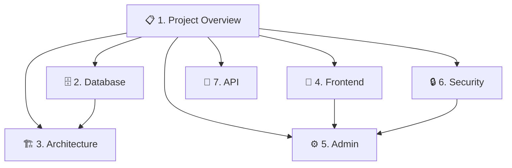

# BPRS Bangka Belitung — CMS Documentation

> [!info] Project Overview
> **CMS** untuk website **PT. Bank Perekonomian Rakyat Syariah (BPRS) Bangka Belitung** — platform perbankan syariah yang menyediakan layanan simpanan, pembiayaan, deposito, dan kas keliling.

## Tech Stack

| Category | Stack |
|----------|-------|
| **Backend** | Laravel 11.x (PHP 8.x) |
| **Frontend** | Blade + Alpine.js + Tailwind CSS v4 / Bulma |
| **CSS Framework** | Tailwind CSS v4 (migrated from Bulma) |
| **Build Tool** | Vite 6.x |
| **Database** | MySQL / MariaDB |
| **Caching** | Redis / File cache |
| **JS Libraries** | Alpine.js 3.x, Chart.js, Swiper.js, CKEditor 5, SweetAlert2 |
| **Image Opt** | Glide / Intervention Image |
| **Security** | CSP with nonces, DDoS protection, Session hijacking detection |

## Vault Structure

## Quick Links

- [[Database Schema]] — All tables and relationships
- [[Architecture Overview]] — Controllers, Services, Middleware
- [[Frontend Components]] — Blade components and layouts
- [[Admin Panel]] — Admin dashboard and CRUD
- [[Security Setup]] — CSP, DDoS, Session security
- [[Visual Roadmap.canvas|📊 Visual Roadmap]] — Development roadmap

## Key Features

> [!tip] Key Capabilities
> - ✅ **Full CMS** — Berita, Produk, Lelang, Karir
> - ✅ **Hero Slider** — With WebP/AVIF image optimization
> - ✅ **Kas Keliling Scheduler** — Schedule management
> - ✅ **Financing Simulation** — Interactive calculator
> - ✅ **Customer Complaints** — Ticket system with tracking
> - ✅ **Security** — CSP, DDoS, Session hijacking protection
> - ✅ **SEO** — OG tags, JSON-LD, canonical URLs
> - ✅ **Multi-role** — Super Admin, Admin, Editor
