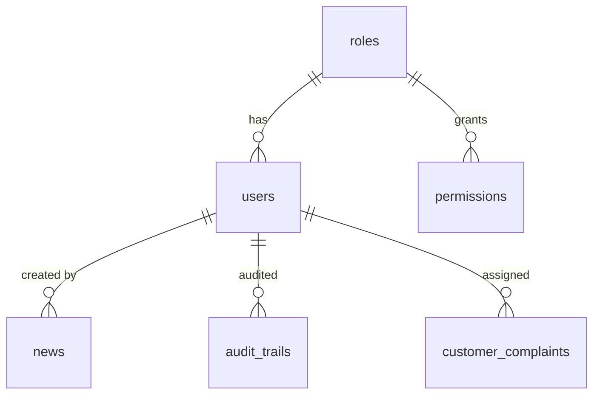

# Database Schema

> [!abstract] Tables Overview
> Total ~30+ tables covering content management, security, settings, and business logic.

## Core Tables

### `users` — User Management
| Column | Type | Description |
|--------|------|-------------|
| `id` | bigint AI | Primary key |
| `name` | string(255) | Full name |
| `email` | string(255) | Login email (unique) |
| `password` | string(255) | Bcrypt hashed |
| `role_id` | bigint FK | References `roles.id` |
| `is_active` | boolean | Account status |
| `last_login_at` | timestamp | Last login |
| `remember_token` | string(100) | Auth remember |

### `roles` & `permissions` — RBAC
- `roles` — `id`, `name`, `display_name`, `guard_name`, `is_system`
- `permissions` — `id`, `name`, `guard_name`, `group`
- `role_permissions` — `role_id`, `permission_id` (pivot)

## Content Tables

### `news` — Berita & Artikel
| Column | Type | Description |
|--------|------|-------------|
| `title` | string(255) | Article title |
| `slug` | string(255) | URL slug (unique) |
| `content` | longText | HTML content (CKEditor) |
| `excerpt` | text | Short description |
| `featured_image` | text | Image path |
| `category` | string(100) | Category |
| `is_published` | boolean | Published status |
| `published_at` | timestamp | Publish date |
| `views` | bigint | View counter |
| `reading_time_minutes` | int | Est. reading time |
| `author_id` | bigint FK | References `users.id` |
| `meta_title` / `meta_description` | text | SEO fields |

### `products` — Produk & Layanan
| Column | Type | Description |
|--------|------|-------------|
| `name` | string(255) | Product name |
| `slug` | string(255) | URL slug (unique) |
| `type` | enum | `simpanan_syariah`, `pembiayaan`, `deposito` |
| `short_description` | text | Summary |
| `description` | longText | Full description |
| `benefits` | longText | Benefits section |
| `requirements` | longText | Requirements |
| `procedure` | longText | Application procedure |
| `icon` | text | Product icon image |
| `category_id` | bigint FK | References categories |
| `brochure_file` | text | PDF brochure |

### `auctions` — Lelang Agunan
| Column | Type | Description |
|--------|------|-------------|
| `title` | string(255) | Auction title |
| `slug` | string(255) | URL slug |
| `description` | longText | Description |
| `main_image` | text | Main image |
| `city` | string(100) | Location city |
| `status` | enum | `draft`, `published`, `registration_open`, `auction_scheduled`, `sold`, `cancelled` |
| `auction_date` | datetime | Auction date |
| `legal_basis` | text | Legal basis text |

### `hero_slides` — Hero Slider
| Column | Type | Description |
|--------|------|-------------|
| `title` | string(255) | Slide title |
| `subtitle` | text | Subtitle / heading |
| `image` | text | Hero image path |
| `link_url` | string(255) | CTA link |
| `link_text` | string(100) | CTA button text |
| `sort_order` | int | Display order |
| `is_active` | boolean | Active status |

## Business Tables

### `kas_keliling` — Kas Keliling
| Column | Type | Description |
|--------|------|-------------|
| `name` | string(255) | Unit name |
| `area_name` | string(255) | Service area |
| `location` | text | Address/location |
| `schedule_info` | text | Schedule info |
| `phone` | string(50) | Contact phone |
| `is_active` | boolean | Active status |

### `kas_keliling_schedules` — Mobile Cash Schedules
| Column | Type | Description |
|--------|------|-------------|
| `kas_keliling_id` | bigint FK | References `kas_keliling.id` |
| `day_name` | enum | `Senin` - `Sabtu` |
| `start_time` | time | Start time |
| `end_time` | time | End time |
| `location` | text | Schedule location |
| `pic_name` | string(255) | Person in charge |
| `is_active` | boolean | Active status |

### `financing_configs` — Financing Simulation
| Column | Type | Description |
|--------|------|-------------|
| `name` | string(255) | Financing name |
| `type` | enum | `murabahah`, `musyarakah`, `mudharabah`, `rahn` |
| `min_amount` | decimal | Minimum amount |
| `max_amount` | decimal | Maximum amount |
| `min_tenor_months` | int | Min tenor |
| `max_tenor_months` | int | Max tenor |
| `margin_rate` | decimal | Margin rate |
| `dp_percentage` | decimal | DP percentage |

## Security Tables

### `security_settings` — Security Configuration
| Column | Type | Description |
|--------|------|-------------|
| `max_login_attempts` | int | Max attempts before lockout |
| `lockout_duration` | int | Lockout in minutes |
| `password_expiry_days` | int | Password expiration |
| `session_timeout` | int | Session idle timeout |
| `two_factor_enabled` | boolean | 2FA status |
| `idle_timeout` | int | Idle timeout in minutes |
| `idle_warning` | int | Warning before timeout |
| `auto_extend_session` | boolean | Auto-extend session |

### `audit_trails` — Activity Logging
| Column | Type | Description |
|--------|------|-------------|
| `user_id` | bigint FK | Reference user |
| `action` | string | Action type |
| `description` | text | Description |
| `ip_address` | string | Client IP |
| `user_agent` | text | Browser UA |
| `metadata` | JSON | Additional data |

## Customer Service Tables

### `customer_complaints` — Pengaduan Nasabah
| Column | Type | Description |
|--------|------|-------------|
| `ticket_number` | string | Unique ticket code |
| `subject` | string(255) | Complaint subject |
| `description` | text | Complaint details |
| `status` | enum | `pending`, `in_review`, `investigating`, `resolved`, `closed` |
| `priority` | enum | `low`, `medium`, `high` |
| `subcategory` | string | Complaint subcategory |
| `customer_name` | string | Name |
| `customer_email` | string | Email |
| `attachments` | JSON | File paths |

## Settings Tables

### `company_infos` — Company Profile
| Column | Type | Description |
|--------|------|-------------|
| `name` | string(255) | Company name |
| `address` | text | Company address |
| `phone` | string(50) | Phone |
| `email` | string(255) | Email |
| `logo` | text | Logo image path |
| `logo_footer` | text | Footer logo |
| `favicon` | text | Favicon path |
| `short_description` | text | Company description |
| `footer_description` | text | Footer text |
| `vision` | text | Company vision |
| `mission` | text | Company mission |
| `facebook` / `instagram` / `youtube` / `twitter` / `tiktok` / `linkedin` | text | Social media URLs |
| `stats_*` | various | Statistics fields |

### `why_choose_us_settings` & `why_choose_us` — Why Choose Us Section
Settings: section title, subtitle, image, active status
Items: title, description, icon, bg_class, text_class, sort_order

## Migration Strategy

> [!warning] Database Note
> The project has ~60+ migration files covering iterative development. Key migrations are organized by date prefix:
> - `2024_*` — Initial schema
> - `2025_12_*` — Feature additions
> - `2026_01_*` — Refinements & RBAC
> - `2026_02_*` — Recreations & fixes
> - `2026_07_*` — Recent updates

## Related

- [[Architecture Overview]]
- [[Admin Panel]]
