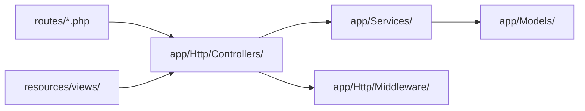
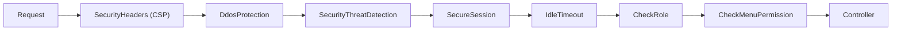

# Architecture Overview

> [!abstract] Architecture Pattern
> **Laravel MVC** with **Service Layer** pattern. Controllers are thin — business logic lives in `Services/` and `Middleware/`.

## Directory Structure



## Controllers

### Auth Controllers — `app/Http/Controllers/Auth/`
| File | Route | Description |
|------|-------|-------------|
| `AdminLoginController.php` | `POST /admin/login` | Admin login with CAPTCHA |
| `SessionController.php` | `POST /admin/logout` | Logout + session invalidate |
| `PasswordController.php` | `POST /password/*` | Password change |
| `NewPasswordController.php` | `POST /reset-password` | Password reset |
| `PasswordResetLinkController.php` | `POST /forgot-password` | Reset link |

> [!tip] Login Flow
> Admin login uses **Math CAPTCHA** verification + **rate limiting** (5 attempts). See [[Security Setup]] for details.

### Frontend Controllers
| File | Route Prefix | Description |
|------|-------------|-------------|
| `HomeController.php` | `/` | Homepage with hero, products, news |
| `ProductController.php` | `/products` | Product listing & detail |
| `NewsController.php` | `/news` | News with search & filter |
| `AuctionController.php` | `/auctions` | Auction listing & detail |
| `CareerController.php` | `/careers` | Career listing & detail |
| `ContactController.php` | `/contact` | Contact form |
| `ReportController.php` | `/reports/*` | Financial reports |

### Admin Controllers — `app/Http/Controllers/Admin/`
| File | Description |
|------|-------------|
| `DashboardController.php` | Admin dashboard with stats |
| `NewsController.php` | News CRUD with CKEditor |
| `ProductController.php` | Product CRUD |
| `AuctionController.php` | Auction CRUD |
| `HeroSlideController.php` | Hero slider management |
| `KasKelilingController.php` | Kas keliling CRUD |
| `UserController.php` | User management |
| `RoleController.php` | Role & permission management |
| `CompanyInfoController.php` | Company profile settings |
| `SiteSettingsController.php` | Site settings |
| `SecuritySettingsController.php` | Security configuration |
| `VisitorStatsController.php` | Visitor analytics |

## Services — `app/Services/`

| Service | Description |
|---------|-------------|
| `CacheService.php` | Centralized caching (products, news, hero, stats) |
| `ImageOptimizerService.php` | Image optimization with WebP/AVIF |
| `HeroSliderService.php` | Hero slider with image variants |
| `SecurityService.php` | Threat detection & rate limiting |
| `Cache/AdminMenuCacheService.php` | Admin menu caching |
| `WhyChooseUsService.php` | Why choose us section |

## Middleware Stack — `app/Http/Middleware/`



| Middleware | Priority | Description |
|-----------|----------|-------------|
| `SecurityHeaders.php` | 1 | CSP, HSTS, X-Frame, Permissions-Policy |
| `DdosProtection.php` | 2 | Rate limiting per IP + user |
| `BaseDdosProtection.php` | 2 | Base DDOS config |
| `SecurityThreatDetection.php` | 3 | SQLi, XSS, path traversal detection |
| `OptimizeFileUpload.php` | 4 | Upload optimization |
| `SecureSessionMiddleware.php` | 5 | Session hijacking prevention |
| `IdleTimeoutMiddleware.php` | 6 | Idle session timeout |
| `CheckRole.php` | 7 | Role-based access |
| `CheckMenuPermission.php` | 8 | Menu permission check |

## Routes — `routes/`

| File | Prefix | Middleware |
|------|--------|------------|
| `web.php` | `/` | web |
| `auth.php` | `/` | web, guest |
| `admin.php` | `/admin` | web, auth, admin |
| `hero-slider-routes.php` | `/admin/hero-slider` | web, auth, admin |
| `debug.php` | `/admin/_debug` | web, auth, admin |

## Caching Strategy

> [!example] Cache Keys
> ```
> products_active_      → Products (24h)
> news_published_       → News list (1h)
| hero_slides_active   → Hero slides (24h)
> why_choose_us        → Why Choose Us (24h)
> admin_sidebar_nav    → Admin nav (1h)
> visitor_stats_*      → Visitor stats (5min)
> ```

## Related

- [[Database Schema]]
- [[Security Setup]]
- [[Frontend Components]]
