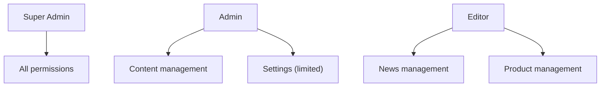

# Security Setup

> [!warning] Security is layered
> The application implements **defense in depth** — multiple independent security layers that protect against different attack vectors.

## Content Security Policy (CSP)

File: `app/Http/Middleware/SecurityHeaders.php`

### Script Sources
```
script-src 'nonce-{nonce}' 'strict-dynamic' 'unsafe-eval'
           https://cdn.jsdelivr.net
           https://unpkg.com
           https://code.jquery.com
           https://cdn.ckeditor.com
           https://analytics.ahrefs.com
```

> [!tip] Nonce-based CSP
> Every `<script>` tag across the codebase uses `nonce="{{ $nonce }}"`. The nonce is generated per-request in `SecurityHeaders.php` and shared via `request()->attributes->get('csp_nonce')`.

### Security Headers
| Header | Value |
|--------|-------|
| `X-Frame-Options` | `DENY` |
| `X-Content-Type-Options` | `nosniff` |
| `Referrer-Policy` | `strict-origin-when-cross-origin` |
| `Permissions-Policy` | `geolocation=(self)` |
| `Strict-Transport-Security` | `max-age=31536000; includeSubDomains` (production only) |

## DDoS Protection

File: `app/Http/Middleware/DdosProtection.php`

### Rate Limits
| Tier | Requests | Window |
|------|----------|--------|
| **Normal** | 60 | 1 minute |
| **Elevated** | 120 | 1 minute |
| **High** | 240 | 1 minute |
| **Critical** | 480 | 1 minute |

> [!warning] IP Blocking
> Repeat offenders are blocked for 24 hours. Blocked IPs stored in `blocked_ips` table.

## Session Security

File: `app/Http/Middleware/SecureSessionMiddleware.php`

### Protection Layers
1. **IP Fingerprinting** — Binds session to IP address
2. **User-Agent Check** — Validates browser fingerprint
3. **Session Regeneration** — Every 30 minutes
4. **Hijacking Detection** — Locks account on mismatch
5. **Device Fingerprint** — JS-based browser fingerprint via `x-device-fingerprint`

### Session Config (`config/session.php`)
| Setting | Value |
|---------|-------|
| `driver` | `file` (or `database`) |
| `lifetime` | 120 minutes |
| `expire_on_close` | false |
| `encrypt` | true |
| `cookie` | `httponly`, `secure`, `samesite=strict` |

## Idle Timeout

File: `app/Http/Middleware/IdleTimeoutMiddleware.php`

- Timeout: Configurable via database (`security_settings.idle_timeout`)
- Warning: Shows warning before timeout
- Auto-extend: Optional session auto-extension
- Redirect: To `route('admin.login')`

## Authentication

File: `app/Http/Controllers/Auth/AdminLoginController.php`

### Login Flow
1. **Math CAPTCHA** — Random addition/subtraction
2. **Rate Limiting** — 5 attempts before lockout
3. **Active Check** — `is_active` must be true
4. **Role Check** — Must be `super_admin` or `admin`
5. **Audit Trail** — Login/logout logged
6. **Session Regeneration** — On success

### Password Policy
- Minimum 8 characters with complexity
- Password history (prevents reuse)
- Optional expiration (configurable)
- Strong password validation rule

## RBAC — Role Based Access Control



### Role Types
| Role | Description |
|------|-------------|
| `super_admin` | Full system access |
| `admin` | Content + most settings |
| `editor` | Content only (news, products) |

## Related

- [[Architecture Overview]]
- [[Admin Panel]]
- [[Database Schema]]
